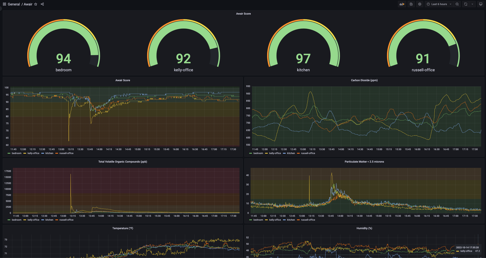

# Prometheus Awair Exporter


[](https://coveralls.io/github/rtrox/prometheus-awair-exporter?branch=main)

> [!IMPORTANT]
> **Multi-Target Exporter Pattern**
>
> As of the 0.2 Release, `prometheus-awair-exporter` uses the [multi-target exporter pattern](https://prometheus.io/docs/guides/multi-target-exporter/). You should now scrape Awair devices using the `/probe?target=<ip>` endpoint. The old single-target `/metrics` mode (using `AWAIR_HOSTNAME`) is deprecated and will be removed in 1.0. Please migrate your Prometheus configs accordingly.

Prometheus Awair Exporter connects to an Awair Element device over the Local API, and exports metrics via Prometheus.



## Operating the Exporter

Prometheus-Awair-Exporter exposes:

- **/metrics**: Exporter self-metrics (Go, process, and exporter info)
- **/probe?target=IP**: Awair device metrics for the specified target IP/hostname

You should configure Prometheus to scrape `/probe?target=<ip>` for each Awair device you want to monitor.

```bash
Usage of ./awair-exporter:
  -debug             sets log level to debug
  -gocollector       enables go stats exporter
  -processcollector  enables process stats exporter
```

### Example Usage

```bash
./awair-exporter -gocollector -processcollector
```

## Running via Docker

Docker images are available [on DockerHub](https://hub.docker.com/repository/docker/rtrox/prometheus-awair-exporter) and [GitHub Container Registry](https://github.com/users/rtrox/packages/container/package/prometheus-awair-exporter). Example usage:

```bash
docker run -d --name awair-exporter -p 8080:8080 ghcr.io/rtrox/prometheus-awair-exporter:latest
```

### Docker Image Tag Reference

| Tag Example                | Description                                                                 |
|----------------------------|-----------------------------------------------------------------------------|
| `v1.2.3`                   | Semantic version tag for a release (major.minor.patch)                       |
| `v1.2`                      | Major.minor tag for a release                                               |
| `v1`                        | Major tag for a release                                                     |
| `latest`                   | Always points to the latest versioned release                               |
| `sha-abcdef1`              | Image for a specific commit (short SHA)                                     |
| `main`                     | Moving tag for the main branch (latest commit on main, may be unreleased)    |

**Note:**

- Using the versioned
- Use `main` for testing the most recent changes on the main branch.

## Running via Docker Compose

A docker-compose file is provided in the root of this directory. Simply run:

```bash
docker compose up -d
```


## Running via Kubernetes

Kubernetes manifests are provided in the [`manifests`](kubernetes/manifests/) folder. To deploy the exporter:

```bash
kubectl apply -f manifests/
```

You do **not** need to set `AWAIR_HOSTNAME` for multi-target mode. The `/probe` endpoint will be used for all device scrapes.

---

## Prometheus Scrape Configuration

To scrape multiple Awair devices, use a Prometheus scrape config like the following (see `scrape_config.yaml`):

```yaml
scrape_configs:
  - job_name: awair
    metrics_path: /probe
    static_configs:
      - targets:
          - 192.168.0.3
          - 192.168.0.4
    relabel_configs:
      - source_labels: [__address__]
        target_label: __param_target
      - source_labels: [__param_target]
        target_label: instance
      - target_label: __address__
        replacement: localhost:8080  # exporter address
```

This will instruct Prometheus to call `/probe?target=192.168.0.3` and `/probe?target=192.168.0.4` on the exporter.

## Kubernetes Probe Example

If you are using [Prometheus Operator](https://github.com/prometheus-operator/prometheus-operator), you can use a `Probe` resource (see `kubernetes/manifests/probe.yaml`):

```yaml
apiVersion: monitoring.coreos.com/v1
kind: Probe
metadata:
  name: devices
spec:
  prober:
    url: prometheus-awair-exporter.awair_exporter.svc.cluster.local:8080
    path: /probe
  targets:
    staticConfig:
      static:
        - 192.168.1.1
        - 192.168.1.2
      relabelingConfigs:
        - sourceLabels: [__address__]
          targetLabel: __param_target
        - sourceLabels: [__param_target]
          targetLabel: target
        - targetLabel: __address__
          replacement: prometheus-awair-exporter.awair-exporter.svc:8080
```

---

## Migrating from Single-Target Mode (Version < 0.2)

If you previously used the `AWAIR_HOSTNAME` environment variable and scraped `/metrics`, you must now use the `/probe?target=<ip>` endpoint for each device. Update your Prometheus configuration as shown above. The single-target mode will be removed in a future release.

## Example Metric Output

Awair metrics from a probed target (`/probe?target=<some_ip>`):

```text
# HELP awair_absolute_humidity Absolute Humidity (g/m³)
# TYPE awair_absolute_humidity gauge
awair_absolute_humidity 8.54
# HELP awair_co2 Carbon Dioxide (ppm)
# TYPE awair_co2 gauge
awair_co2 566
# HELP awair_co2_est Estimated Carbon Dioxide (ppm - calculated by the TVOC sensor)
# TYPE awair_co2_est gauge
awair_co2_est 406
# HELP awair_co2_est_baseline A unitless value that represents the baseline from which the TVOC sensor partially derives its estimated (e)CO₂output.
# TYPE awair_co2_est_baseline gauge
awair_co2_est_baseline 35927
# HELP awair_device_info Info about the awair device
# TYPE awair_device_info gauge
awair_device_info{device_uuid="awair-element_85122",firmware_version="1.4.1",voc_feature_set="34"} 1
# HELP awair_dew_point The temperature at which water will condense and form into dew (ºC)
# TYPE awair_dew_point gauge
awair_dew_point 9.16
# HELP awair_humidity Relative Humidity (%)
# TYPE awair_humidity gauge
awair_humidity 46.67
# HELP awair_pm10 Estimated particulate matter less than 10 microns in diameter (µg/m³ - calculated by the PM2.5 sensor)
# TYPE awair_pm10 gauge
awair_pm10 2
# HELP awair_pm25 Particulate matter less than 2.5 microns in diameter (µg/m³)
# TYPE awair_pm25 gauge
awair_pm25 1
# HELP awair_score Awair Score (0-100)
# TYPE awair_score gauge
awair_score 98
# HELP awair_temp Dry bulb temperature (ºC)
# TYPE awair_temp gauge
awair_temp 21.02
# HELP awair_voc Total Volatile Organic Compounds (ppb)
# TYPE awair_voc gauge
awair_voc 141
# HELP awair_voc_baseline A unitless value that represents the baseline from which the TVOC sensor partially derives its TVOC output.
# TYPE awair_voc_baseline gauge
awair_voc_baseline 37223
# HELP awair_voc_ethanol_raw A unitless value that represents the Ethanol gas signal from which the TVOC sensor partially derives its TVOC output.
# TYPE awair_voc_ethanol_raw gauge
awair_voc_ethanol_raw 36
# HELP awair_voc_h2_raw A unitless value that represents the Hydrogen gas signal from which the TVOC sensor partially derives its TVOC output.
# TYPE awair_voc_h2_raw gauge
awair_voc_h2_raw 25
```

Exporter metrics from the process itself (`/metrics`):

```
# HELP awair_exporter_info Info about this awair-exporter
# TYPE awair_exporter_info gauge
awair_exporter_info{app_name="awair-exporter",app_version="x.x.x"} 1
# HELP go_gc_duration_seconds A summary of the wall-time pause (stop-the-world) duration in garbage collection cycles.
# TYPE go_gc_duration_seconds summary
go_gc_duration_seconds{quantile="0"} 0
go_gc_duration_seconds{quantile="0.25"} 0
go_gc_duration_seconds{quantile="0.5"} 0
go_gc_duration_seconds{quantile="0.75"} 0
go_gc_duration_seconds{quantile="1"} 0
go_gc_duration_seconds_sum 0
go_gc_duration_seconds_count 0
# HELP go_gc_gogc_percent Heap size target percentage configured by the user, otherwise 100. This value is set by the GOGC environment variable, and the runtime/debug.SetGCPercent function. Sourced from /gc/gogc:percent.
# TYPE go_gc_gogc_percent gauge
go_gc_gogc_percent 100
# HELP go_gc_gomemlimit_bytes Go runtime memory limit configured by the user, otherwise math.MaxInt64. This value is set by the GOMEMLIMIT environment variable, and the runtime/debug.SetMemoryLimit function. Sourced from /gc/gomemlimit:bytes.
# TYPE go_gc_gomemlimit_bytes gauge
go_gc_gomemlimit_bytes 9.223372036854776e+18
# HELP go_goroutines Number of goroutines that currently exist.
# TYPE go_goroutines gauge
go_goroutines 12
# HELP go_info Information about the Go environment.
# TYPE go_info gauge
go_info{version="go1.25.0"} 1
# HELP go_memstats_alloc_bytes Number of bytes allocated in heap and currently in use. Equals to /memory/classes/heap/objects:bytes.
# TYPE go_memstats_alloc_bytes gauge
go_memstats_alloc_bytes 301056
# HELP go_memstats_alloc_bytes_total Total number of bytes allocated in heap until now, even if released already. Equals to /gc/heap/allocs:bytes.
# TYPE go_memstats_alloc_bytes_total counter
go_memstats_alloc_bytes_total 301056
# HELP go_memstats_buck_hash_sys_bytes Number of bytes used by the profiling bucket hash table. Equals to /memory/classes/profiling/buckets:bytes.
# TYPE go_memstats_buck_hash_sys_bytes gauge
go_memstats_buck_hash_sys_bytes 4150
# HELP go_memstats_frees_total Total number of heap objects frees. Equals to /gc/heap/frees:objects + /gc/heap/tiny/allocs:objects.
# TYPE go_memstats_frees_total counter
go_memstats_frees_total 0
# HELP go_memstats_gc_sys_bytes Number of bytes used for garbage collection system metadata. Equals to /memory/classes/metadata/other:bytes.
# TYPE go_memstats_gc_sys_bytes gauge
go_memstats_gc_sys_bytes 1.496336e+06
# HELP go_memstats_heap_alloc_bytes Number of heap bytes allocated and currently in use, same as go_memstats_alloc_bytes. Equals to /memory/classes/heap/objects:bytes.
# TYPE go_memstats_heap_alloc_bytes gauge
go_memstats_heap_alloc_bytes 301056
# HELP go_memstats_heap_idle_bytes Number of heap bytes waiting to be used. Equals to /memory/classes/heap/released:bytes + /memory/classes/heap/free:bytes.
# TYPE go_memstats_heap_idle_bytes gauge
go_memstats_heap_idle_bytes 1.564672e+06
# HELP go_memstats_heap_inuse_bytes Number of heap bytes that are in use. Equals to /memory/classes/heap/objects:bytes + /memory/classes/heap/unused:bytes
# TYPE go_memstats_heap_inuse_bytes gauge
go_memstats_heap_inuse_bytes 2.039808e+06
# HELP go_memstats_heap_objects Number of currently allocated objects. Equals to /gc/heap/objects:objects.
# TYPE go_memstats_heap_objects gauge
go_memstats_heap_objects 376
# HELP go_memstats_heap_released_bytes Number of heap bytes released to OS. Equals to /memory/classes/heap/released:bytes.
# TYPE go_memstats_heap_released_bytes gauge
go_memstats_heap_released_bytes 1.564672e+06
# HELP go_memstats_heap_sys_bytes Number of heap bytes obtained from system. Equals to /memory/classes/heap/objects:bytes + /memory/classes/heap/unused:bytes + /memory/classes/heap/released:bytes + /memory/classes/heap/free:bytes.
# TYPE go_memstats_heap_sys_bytes gauge
go_memstats_heap_sys_bytes 3.60448e+06
# HELP go_memstats_last_gc_time_seconds Number of seconds since 1970 of last garbage collection.
# TYPE go_memstats_last_gc_time_seconds gauge
go_memstats_last_gc_time_seconds 0
# HELP go_memstats_mallocs_total Total number of heap objects allocated, both live and gc-ed. Semantically a counter version for go_memstats_heap_objects gauge. Equals to /gc/heap/allocs:objects + /gc/heap/tiny/allocs:objects.
# TYPE go_memstats_mallocs_total counter
go_memstats_mallocs_total 376
# HELP go_memstats_mcache_inuse_bytes Number of bytes in use by mcache structures. Equals to /memory/classes/metadata/mcache/inuse:bytes.
# TYPE go_memstats_mcache_inuse_bytes gauge
go_memstats_mcache_inuse_bytes 14496
# HELP go_memstats_mcache_sys_bytes Number of bytes used for mcache structures obtained from system. Equals to /memory/classes/metadata/mcache/inuse:bytes + /memory/classes/metadata/mcache/free:bytes.
# TYPE go_memstats_mcache_sys_bytes gauge
go_memstats_mcache_sys_bytes 15704
# HELP go_memstats_mspan_inuse_bytes Number of bytes in use by mspan structures. Equals to /memory/classes/metadata/mspan/inuse:bytes.
# TYPE go_memstats_mspan_inuse_bytes gauge
go_memstats_mspan_inuse_bytes 65440
# HELP go_memstats_mspan_sys_bytes Number of bytes used for mspan structures obtained from system. Equals to /memory/classes/metadata/mspan/inuse:bytes + /memory/classes/metadata/mspan/free:bytes.
# TYPE go_memstats_mspan_sys_bytes gauge
go_memstats_mspan_sys_bytes 81600
# HELP go_memstats_next_gc_bytes Number of heap bytes when next garbage collection will take place. Equals to /gc/heap/goal:bytes.
# TYPE go_memstats_next_gc_bytes gauge
go_memstats_next_gc_bytes 4.194304e+06
# HELP go_memstats_other_sys_bytes Number of bytes used for other system allocations. Equals to /memory/classes/other:bytes.
# TYPE go_memstats_other_sys_bytes gauge
go_memstats_other_sys_bytes 1.175218e+06
# HELP go_memstats_stack_inuse_bytes Number of bytes obtained from system for stack allocator in non-CGO environments. Equals to /memory/classes/heap/stacks:bytes.
# TYPE go_memstats_stack_inuse_bytes gauge
go_memstats_stack_inuse_bytes 589824
# HELP go_memstats_stack_sys_bytes Number of bytes obtained from system for stack allocator. Equals to /memory/classes/heap/stacks:bytes + /memory/classes/os-stacks:bytes.
# TYPE go_memstats_stack_sys_bytes gauge
go_memstats_stack_sys_bytes 589824
# HELP go_memstats_sys_bytes Number of bytes obtained from system. Equals to /memory/classes/total:byte.
# TYPE go_memstats_sys_bytes gauge
go_memstats_sys_bytes 6.967312e+06
# HELP go_sched_gomaxprocs_threads The current runtime.GOMAXPROCS setting, or the number of operating system threads that can execute user-level Go code simultaneously. Sourced from /sched/gomaxprocs:threads.
# TYPE go_sched_gomaxprocs_threads gauge
go_sched_gomaxprocs_threads 12
# HELP go_threads Number of OS threads created.
# TYPE go_threads gauge
go_threads 9
# HELP process_cpu_seconds_total Total user and system CPU time spent in seconds.
# TYPE process_cpu_seconds_total counter
process_cpu_seconds_total 0.013053
# HELP process_max_fds Maximum number of open file descriptors.
# TYPE process_max_fds gauge
process_max_fds 65535
# HELP process_open_fds Number of open file descriptors.
# TYPE process_open_fds gauge
process_open_fds 12
# HELP process_resident_memory_bytes Resident memory size in bytes.
# TYPE process_resident_memory_bytes gauge
process_resident_memory_bytes 1.1698176e+07
# HELP process_start_time_seconds Start time of the process since unix epoch in seconds.
# TYPE process_start_time_seconds gauge
process_start_time_seconds 1.758227787e+09
# HELP process_virtual_memory_bytes Virtual memory size in bytes.
# TYPE process_virtual_memory_bytes gauge
process_virtual_memory_bytes 4.2125172736e+11
# HELP process_virtual_memory_max_bytes Maximum amount of virtual memory available in bytes.
# TYPE process_virtual_memory_max_bytes gauge
process_virtual_memory_max_bytes 9.223372036854776e+18
```
